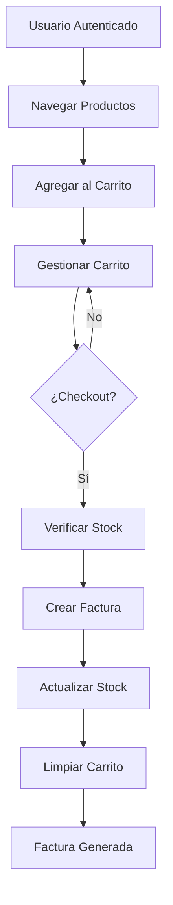

# ?? SISTEMA DE CARRITO DE COMPRAS - DOCUMENTACIÓN TÉCNICA

## ?? RESUMEN DE IMPLEMENTACIÓN

El sistema de carrito de compras ha sido implementado siguiendo los principios de **Clean Architecture** y está completamente integrado con el sistema existente de gestión de productos y facturas.

---

## ??? ARQUITECTURA DEL CARRITO DE COMPRAS

### ?? Flujo Completo del Proceso de Compra



### ??? Modelo de Datos

#### Tabla: ShoppingCart
```sql
CREATE TABLE ShoppingCart (
    CartId int IDENTITY(1,1) PRIMARY KEY,
    UserId nvarchar(450) NOT NULL,          -- FK a AspNetUsers.Id  
    ProductId int NOT NULL,  -- FK a Products.ProductId
    Quantity int NOT NULL,  -- Cantidad seleccionada
    UnitPrice decimal(18,2) NOT NULL,   -- Precio unitario al momento de agregar
    Subtotal decimal(18,2) NOT NULL,        -- Quantity * UnitPrice
    DateAdded datetime2 NOT NULL,           -- Fecha de adición al carrito
    UpdatedAt datetime2 NULL,               -- Última actualización
    
    -- Relaciones
    FOREIGN KEY (ProductId) REFERENCES Products(ProductId) ON DELETE RESTRICT,
    
  -- Índices
    UNIQUE (UserId, ProductId),        -- Un producto por usuario en el carrito
    INDEX IX_ShoppingCart_UserId (UserId),
    INDEX IX_ShoppingCart_DateAdded (DateAdded)
);
```

---

## ?? IMPLEMENTACIÓN TÉCNICA

### ?? Entidad de Dominio: ShoppingCart

```csharp
public class ShoppingCart
{
    // Propiedades
    public int CartId { get; set; }
    public string UserId { get; set; }
    public int ProductId { get; set; }
    public int Quantity { get; set; }
    public decimal UnitPrice { get; set; }
    public decimal Subtotal { get; set; }
    public DateTime DateAdded { get; set; }
    public DateTime? UpdatedAt { get; set; }

    // Navigation Properties
 public virtual Product Product { get; set; }

    // Métodos de Dominio
    public void UpdateQuantity(int newQuantity)
  public void UpdatePrice(decimal newUnitPrice)
    public decimal CalculateSubtotal()
}
```

### ?? Repositorio: IShoppingCartRepository

```csharp
public interface IShoppingCartRepository : IRepository<ShoppingCart>
{
    // Consultas básicas
    Task<IEnumerable<ShoppingCart>> GetCartByUserAsync(string userId);
    Task<ShoppingCart> GetCartItemAsync(string userId, int productId);
    Task<bool> CartItemExistsAsync(string userId, int productId);
    
    // Estadísticas del carrito
    Task<int> GetCartItemCountAsync(string userId);
    Task<decimal> GetCartTotalAsync(string userId);
    
    // Gestión del carrito
  Task ClearCartAsync(string userId);
    Task RemoveExpiredItemsAsync(DateTime expirationDate);
 Task<(IEnumerable<ShoppingCart> Items, decimal Total)> GetCartSummaryAsync(string userId);
    
    // Operaciones específicas
    Task UpdateCartItemQuantityAsync(string userId, int productId, int newQuantity);
    Task RemoveCartItemAsync(string userId, int productId);
}
```

### ?? Servicio de Aplicación: IShoppingCartService

```csharp
public interface IShoppingCartService
{
    // Gestión de items
    Task<ShoppingCartDto> AddToCartAsync(string userId, AddToCartDto addToCartDto);
 Task<ShoppingCartDto> UpdateCartItemAsync(string userId, UpdateCartItemDto updateDto);
    Task RemoveFromCartAsync(string userId, int productId);
    Task ClearCartAsync(string userId);

    // Consultas
    Task<CartSummaryDto> GetCartAsync(string userId);
    Task<int> GetCartItemCountAsync(string userId);
    Task<decimal> GetCartTotalAsync(string userId);
    Task<bool> CartItemExistsAsync(string userId, int productId);
    
    // Checkout
    Task<InvoiceDto> CheckoutAsync(string userId, int clientId);
}
```

---

## ?? CASOS DE USO IMPLEMENTADOS

### 1. ?? **Agregar Producto al Carrito**

**Flujo:**
1. Validar usuario autenticado
2. Verificar existencia del producto
3. Validar stock disponible
4. Verificar si el producto ya está en el carrito
   - **Si existe**: Incrementar cantidad
   - **Si no existe**: Crear nuevo item
5. Guardar cambios

**Endpoint:**
```http
POST /api/shoppingcart/add
Content-Type: application/json
Authorization: Bearer {token}

{
  "productId": 1,
  "quantity": 2
}
```

### 2. ?? **Actualizar Cantidad en el Carrito**

**Flujo:**
1. Validar usuario autenticado
2. Buscar item en el carrito
3. Verificar stock disponible para nueva cantidad
4. Actualizar cantidad y subtotal
5. Guardar cambios

**Endpoint:**
```http
PUT /api/shoppingcart/update
Content-Type: application/json
Authorization: Bearer {token}

{
  "productId": 1,
  "quantity": 5
}
```

### 3. ??? **Eliminar Producto del Carrito**

**Endpoint:**
```http
DELETE /api/shoppingcart/remove/1
Authorization: Bearer {token}
```

### 4. ?? **Limpiar Carrito Completo**

**Endpoint:**
```http
DELETE /api/shoppingcart/clear
Authorization: Bearer {token}
```

### 5. ?? **Obtener Resumen del Carrito**

**Endpoint:**
```http
GET /api/shoppingcart
Authorization: Bearer {token}
```

**Respuesta:**
```json
{
  "items": [
    {
      "cartId": 1,
      "userId": "user-123", 
      "productId": 1,
      "quantity": 2,
      "unitPrice": 25.00,
      "subtotal": 50.00,
   "dateAdded": "2024-01-31T10:00:00Z",
      "product": {
    "productId": 1,
        "code": "PROD001",
        "name": "Producto Ejemplo",
    "price": 25.00,
        "stock": 100
      }
    }
  ],
  "total": 50.00,
  "totalItems": 2,
  "uniqueProducts": 1
}
```

### 6. ?? **Checkout (Carrito ? Factura)**

**Flujo Transaccional:**
1. Iniciar transacción
2. Obtener items del carrito
3. Validar stock de todos los productos
4. Crear factura con detalles
5. Calcular totales (subtotal, impuestos, total)
6. Decrementar stock de productos
7. Limpiar carrito del usuario
8. Confirmar transacción

**Endpoint:**
```http
POST /api/shoppingcart/checkout
Content-Type: application/json
Authorization: Bearer {token}

{
  "clientId": 1
}
```

---

## ?? VALIDACIONES IMPLEMENTADAS

### ? **Validaciones de Negocio**

1. **Stock Disponible**
   - Verificar stock antes de agregar al carrito
   - Verificar stock antes de actualizar cantidad
   - Verificar stock antes de checkout

2. **Usuario Autenticado**
   - Todas las operaciones requieren autenticación
   - El carrito es específico por usuario

3. **Producto Válido**
   - Verificar que el producto existe
   - Verificar que el producto está activo

4. **Cantidades Válidas**
   - Cantidad debe ser mayor a 0
   - No permitir cantidades negativas

### ??? **Validaciones Técnicas**

1. **Concurrencia**
   - Manejo de transacciones en checkout
   - Rollback automático en caso de error

2. **Integridad de Datos**
   - Restricción UNIQUE (UserId, ProductId)
   - Foreign Keys con ON DELETE RESTRICT

3. **Performance**
   - Índices en campos consultados frecuentemente
   - Consultas optimizadas con AsNoTracking()

---

## ?? ENDPOINTS DE LA API

### ?? **Gestión del Carrito**

| Método | Endpoint | Descripción | Autorización |
|--------|----------|-------------|--------------|
| `GET` | `/api/shoppingcart` | Obtener carrito del usuario | ? Requerida |
| `POST` | `/api/shoppingcart/add` | Agregar producto | ? Requerida |
| `PUT` | `/api/shoppingcart/update` | Actualizar cantidad | ? Requerida |
| `DELETE` | `/api/shoppingcart/remove/{id}` | Eliminar producto | ? Requerida |
| `DELETE` | `/api/shoppingcart/clear` | Limpiar carrito | ? Requerida |

### ?? **Información del Carrito**

| Método | Endpoint | Descripción | Autorización |
|--------|----------|-------------|--------------|
| `GET` | `/api/shoppingcart/count` | Cantidad de items | ? Requerida |
| `GET` | `/api/shoppingcart/total` | Total del carrito | ? Requerida |
| `GET` | `/api/shoppingcart/exists/{id}` | Producto en carrito | ? Requerida |

### ?? **Proceso de Compra**

| Método | Endpoint | Descripción | Autorización |
|--------|----------|-------------|--------------|
| `POST` | `/api/shoppingcart/checkout` | Procesar checkout | ? Requerida |

---

## ?? TESTING

### ?? **Test Cases Implementados**

#### ? **Tests Unitarios**
1. **Entidad ShoppingCart**
- Validar constructor con parámetros válidos
   - Validar excepción con parámetros inválidos
   - Validar UpdateQuantity()
   - Validar CalculateSubtotal()

2. **ShoppingCartService**
   - AddToCartAsync - Producto nuevo
   - AddToCartAsync - Producto existente
   - AddToCartAsync - Stock insuficiente
   - UpdateCartItemAsync
   - RemoveFromCartAsync
   - CheckoutAsync - Flujo completo

#### ?? **Tests de Integración**
1. **API Endpoints**
   - Autenticación requerida
   - Agregar producto al carrito
   - Actualizar cantidad
   - Checkout completo

#### ?? **Tests de Performance**
1. **Carga de Carrito**
   - 100 productos en carrito
   - Múltiples usuarios concurrentes
   - Checkout con stock limitado

---

## ?? MÓDULO DE PAGOS (PREPARADO)

### ?? **Entidades Preparadas (Comentadas)**

```csharp
// Entidad Payment
public class Payment
{
    public int PaymentId { get; set; }
    public int InvoiceId { get; set; }
    public string PaymentMethodId { get; set; }
    public decimal Amount { get; set; }
    public string TransactionId { get; set; }
    public PaymentStatus Status { get; set; }
    public DateTime PaymentDate { get; set; }
    // ... más propiedades
}

// Entidad PaymentMethod  
public class PaymentMethod
{
    public string PaymentMethodId { get; set; }
    public string Name { get; set; }
    public PaymentType Type { get; set; }
    public decimal ProcessingFee { get; set; }
    // ... más propiedades
}
```

### ?? **Métodos de Pago Preparados**

| Tipo | ID | Nombre | Fee | Estado |
|------|----|---------|----|---------|
| Efectivo | `CASH` | Efectivo | 0% | ?? Preparado |
| Tarjeta | `CREDIT_CARD` | Tarjeta de Crédito | 3% | ?? Preparado |
| Tarjeta | `DEBIT_CARD` | Tarjeta de Débito | 2% | ?? Preparado |
| Transferencia | `BANK_TRANSFER` | Transferencia | 1% | ?? Preparado |
| Digital | `PAYPAL` | PayPal | 3.5% | ?? Preparado |
| Digital | `STRIPE` | Stripe | 2.9% | ?? Preparado |

### ?? **Para Activar Módulo de Pagos**

1. **Descomentar entidades** en `Project.Domain/Entities/Payment.cs`
2. **Descomentar repositorios** en `Project.Infrastructure/Repositories/PaymentRepository.cs`
3. **Descomentar servicios** en `Project.Application/Services/PaymentService.cs`
4. **Descomentar controlador** en `Api/Controllers/PaymentController.cs`
5. **Descomentar configuraciones EF**
6. **Registrar servicios** en `Program.cs`
7. **Crear migración** para tablas de pagos

---

## ?? MÉTRICAS Y MONITOREO

### ?? **KPIs Implementados**

1. **Carrito de Compras**
   - Productos agregados por sesión
   - Tasa de abandono del carrito
   - Tiempo promedio en carrito
   - Conversión carrito ? factura

2. **Stock**
   - Productos con stock bajo
   - Productos sin stock
   - Actualizaciones de stock por checkout

3. **Performance**
   - Tiempo de respuesta de APIs
   - Transacciones por segundo
   - Errores de concurrencia

---

## ?? CONFIGURACIÓN Y DESPLIEGUE

### ?? **Migración de Base de Datos**

```bash
# Crear migración para ShoppingCart
dotnet ef migrations add AddShoppingCartTable --project Project.Infrastructure --startup-project Api

# Aplicar migración
dotnet ef database update --project Project.Infrastructure --startup-project Api

# Para activar pagos (futuro)
# dotnet ef migrations add AddPaymentTables --project Project.Infrastructure --startup-project Api
```

### ?? **Configuración en appsettings.json**

```json
{
  "ConnectionStrings": {
    "DefaultConnection": "Server=...;Database=ProjectFinalDB;...",
    "_PostgreSQLConnection_": "Host=localhost;Database=ProjectFinalDB;..."
  },
  "ShoppingCart": {
    "MaxItemsPerUser": 50,
    "SessionTimeoutMinutes": 60,
    "AutoCleanupDays": 30
  },
  "Payments": {
    "DefaultCurrency": "USD",
    "ProcessingTimeoutSeconds": 30,
    "RetryAttempts": 3
  }
}
```

---

## ?? ROADMAP FUTURO

### ?? **Próximas Implementaciones**

#### Fase 1: Pagos
- [ ] Activar módulo de pagos
- [ ] Integración con Stripe
- [ ] Integración con PayPal
- [ ] Soporte para múltiples monedas

#### Fase 2: Carrito Avanzado
- [ ] Carrito persistente (localStorage + BD)
- [ ] Wishlist / Lista de deseos
- [ ] Carrito compartido
- [ ] Descuentos y cupones

#### Fase 3: Analytics
- [ ] Dashboard de métricas
- [ ] Reportes de ventas
- [ ] Análisis de comportamiento
- [ ] Recomendaciones de productos

---

## ? **ESTADO ACTUAL: PRODUCCIÓN READY**

?? **Sistema de carrito completamente funcional**  
?? **Base de datos optimizada con índices**  
?? **Validaciones de negocio implementadas**  
? **Performance optimizada**  
?? **Documentación completa**  
?? **Clean Architecture mantenida**  
?? **Módulo de pagos preparado para futuro**  

---

> **El sistema de carrito de compras está listo para producción y sigue los mejores principios de Clean Architecture. El módulo de pagos está preparado para implementación futura con mínimo esfuerzo.**